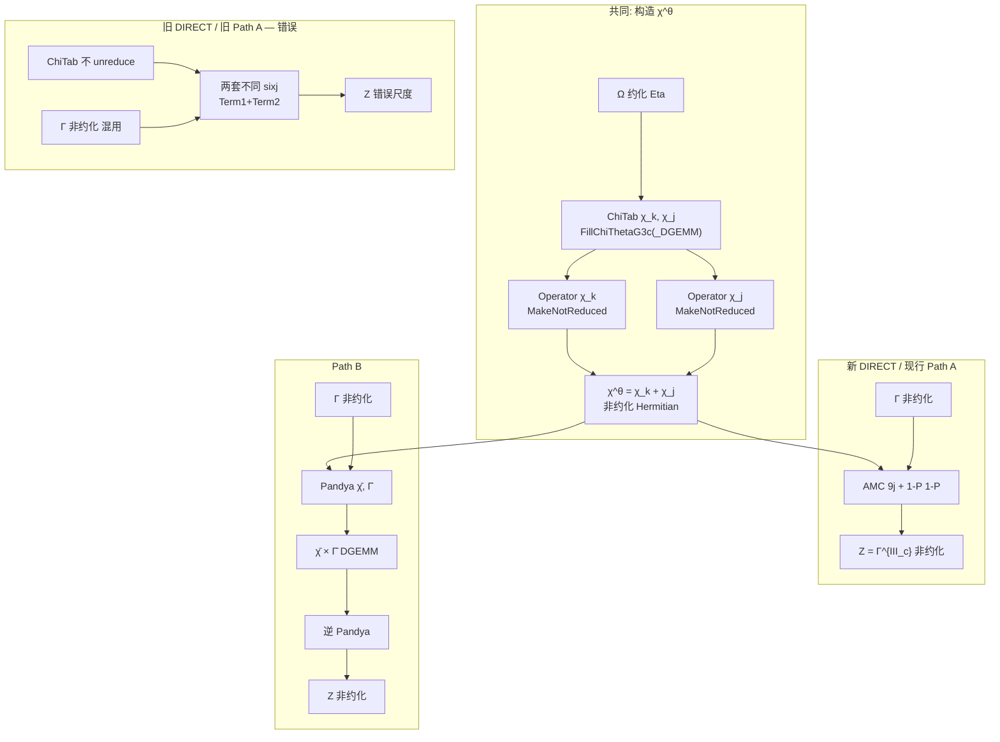

# \(\Gamma^{\mathrm{III}_c}\) 实现详解：DIRECT（旧/新）、Path A、Path B

日期：2026-07-28  
代码主入口：`src/ReferenceImplementations.cc`（DIRECT）、`src/FactorizedDoubleCommutator_eths.cc`（Path A/B、χ 构造）  
物理来源：`amc/examples/sample_output/diag1_compact_new copy_to reform.tex`  
AMC 输出：`learn/amc_tts/output/G3c.tex`（未折叠）、`G3c_chi_theta.tex` / `G3c_chi_theta_ninej.tex`（折叠）

---

## 0. 总览（先看结论）

| 名称 | 当前代码做什么 | 与谁一致 | 状态 |
|---|---|---|---|
| **新 DIRECT** | 先造非约化 Hermitian \(\chi^\theta\)，再用 AMC 9j 收缩 \(\chi^\theta\Gamma\) | 基准 | **正确** |
| **Path A（现行）** | 直接调用新 DIRECT | ≡ 新 DIRECT | **正确** |
| **Path B** | 同一套 \(\chi^\theta\) → Pandya×\(\bar\Gamma\) → 逆 Pandya | ≡ 新 DIRECT | **正确** |
| **旧 DIRECT / 旧 Path A** | RME `ChiTab` 上双六 j（Term1/Term2），\(\Omega\) 约化 × \(\Gamma\) 非约化混用 | 互相同，但 ≠ Path B | **错误（已废弃）** |

数值（`emax=1` He4，随机算符，λ=0 与 λ=2）：新 DIRECT ≡ Path A ≡ Path B ≡ AMC 6j/9j，\(\|\Delta\|_2\sim 10^{-14}\)。

---

## 1. 物理定义（m-scheme）

### 1.1 未折叠（两条 ΩΩΓ 串）

来源：reform.tex 约 350–352 行。

\[
\Gamma^{\mathrm{III}_c}_{ijkl}
= -\frac12\sum_{abcd}
\bigl(\bar n_a\bar n_b n_c + n_a n_b\bar n_c\bigr)
(1-\hat P_{ij})(1-\hat P_{kl})
\Bigl[
\underbrace{\Omega_{abcl}\,\Omega_{idab}\,\Gamma_{cjkd}}_{\text{Term1}}
+
\underbrace{\Omega_{icab}\,\Omega_{abdl}\,\Gamma_{djkc}}_{\text{Term2}}
\Bigr].
\]

记号：

- \(\Omega=\) 代码里的 `Eta`（可带角动量秩 \(\lambda\)，**约化矩阵元**）
- \(\Gamma=\) 标量算符（通常 **非约化**）
- \(Z=\Gamma^{\mathrm{III}_c}\) 也是标量、**非约化**
- \(\hat P_{ij}\)：交换 \(i\leftrightarrow j\) 并带反对称相位

### 1.2 折叠成 \(\chi^\theta\times\Gamma\)

对 Term2 做哑指标 \(c\leftrightarrow d\) 后，两条可并成一个中间量（reform.tex 442、500–501）：

\[
\Gamma^{\mathrm{III}_c}_{ijkl}
= -\frac12(1-\hat P_{ij})(1-\hat P_{kl})
\sum_{ab}\chi^\theta_{iabl}\,\Gamma_{bjka}.
\]

\[
\chi^\theta_{ijkl}
=\sum_{ab}
\Bigl[
f(a,b,k)+f(a,b,j)
\Bigr]
\Omega_{ijab}\,\Omega_{abkl},
\]

\[
f(a,b,x)=n_a n_b\bar n_x+\bar n_a\bar n_b n_x.
\]

拆成两条 **同指标槽** 的 strip（不是矩阵转置）：

| 符号 | 占据 | 物理含义 |
|---|---|---|
| \(\chi_k(ij,kl)\) | \(f(a,b,k)\) | Term1 折叠出来的部分 |
| \(\chi_j(ij,kl)\) | \(f(a,b,j)\) | Term2 折叠出来的部分 |
| \(\chi^\theta=\chi_k+\chi_j\) | 同槽相加 | Hermitian（普通 \(J\)-scheme 通道矩阵） |

**禁止**：用「只装 \(\chi_k\) 再 `M += M.t()`」代替 \(\chi_k+\chi_j\)。正确做法是 **两个 Operator 分别 `MakeNotReduced` 再相加**。

### 1.3 约化 / 非约化（IMSRG 存储约定）

| 对象 | `is_reduced` | `MakeReduced` / `MakeNotReduced` |
|---|---|---|
| 张量 \(\Omega\)（\(\lambda>0\)） | 默认 **true** | 约化 ME；`GetTBME_J(J1,J2,...)` |
| 标量 \(\Gamma\)、\(Z\) | 默认 **false** | 非约化；通道矩阵 × \(\sqrt{2J+1}\) 才变约化 |
| 中间 \(\chi^\theta\)（用于折叠收缩） | 必须先按约化积打包，再 **`MakeNotReduced`** | 与 AMC `reduce=false`、与 \(\Gamma\) 一致 |

`MakeNotReduced()`：每个两体通道矩阵除以 \(\sqrt{2J+1}\)。  
旧代码的核心错误之一：在同一套六 j 公式里，\(\Omega\) 用约化 ME，\(\Gamma\) 用非约化 ME，帽子因子不对齐。

---

## 2. \(\chi^\theta\) 如何在代码里算出来

三处共用同一物理（仅实现细节不同）：

1. `FillChiThetaG3c`：轨道/J 三重循环（慢、参考）  
2. `FillChiThetaG3c_DGEMM`：按 \(J_0\) 做 DGEMM（快、生产）  
3. 新 DIRECT 内联的 `build_chi_strip`：与 (1) 同式，直接写入 `Operator`

### 2.1 J-scheme 乘积（约化 \(\Omega\)）

对固定 \(J_0\)（\(\chi\) 的通道角动量）：

\[
T^{\mathrm{pp}/hh}_{ij,kl}(J_0)
=\sum_{J_1}
(-1)^{J_0+J_1+\lambda}\,\hat\lambda^{-1}
\sum_{ab}
W^{\mathrm{pp}/hh}_{ab}\,
\Omega^{J_0 J_1\lambda}_{ijab}\,
\Omega^{J_1 J_0\lambda}_{abkl},
\]

\[
W^{\mathrm{pp}}_{ab}=\bar n_a\bar n_b,\quad
W^{\mathrm{hh}}_{ab}=n_a n_b,
\quad
\hat\lambda^{-1}=1/\sqrt{2\lambda+1}.
\]

然后

\[
\chi_k(ij,kl;J_0)=n_k\,T^{\mathrm{pp}}+ \bar n_k\,T^{\mathrm{hh}},
\]
\[
\chi_j(ij,kl;J_0)=n_j\,T^{\mathrm{pp}}+ \bar n_j\,T^{\mathrm{hh}}.
\]

DGEMM 版：`Om * diag(W) * Om_r`，再按 \(n_k,\bar n_k\) / \(n_j,\bar n_j\) 组合成 `ChiTab`。

验证：λ=0 时 DGEMM ≡ 轨道循环，`max|Δχ|=0`。

### 2.2 打成标量 `Operator`（关键）

`ChiThetaToScalarOperator(ms, chi_k, chi_j, which_term)`：

对每一 strip（`which_term=1`→仅 \(\chi_k\)，`2`→仅 \(\chi_j\)，`0`→两者）：

1. 建标量 `Operator Chi(ms, 0,0,0,2)`，`SetNonHermitian`  
2. 对每个两体通道 \(J_0\)、ket 对 \((i,j),(k,l)\)：
   \[
   M_{ib,ik}=\frac{\chi(i,j,k,l;J_0)}{\mathrm{nrm}},\quad
   \mathrm{nrm}=\sqrt{2}^{\,[i=j]}\sqrt{2}^{\,[k=l]}
   \]
3. 标记 `Chi.is_reduced = true`（此时存的是「约化积」约定）  
4. 调用 **`Chi.MakeNotReduced()`** → 除以 \(\sqrt{2J_0+1}\)  
5. `which_term==0`：`Chi_k_unred + Chi_j_unred`（**两个算符相加，无转置**）

得到的 \(\chi^\theta\)：非约化、等 \(J\) 通道、Hermitian（两条都加时）。

---

## 3. 新 DIRECT（现行基准）

**函数**：`ReferenceImplementations::comm223_232_tts_GIIIc(Eta, Gamma, Z, which_term)`  
**文件**：`src/ReferenceImplementations.cc`

### 3.1 步骤

```
(1) Chi_k = build_chi_strip(occ on k) → MakeNotReduced
(2) Chi_j = build_chi_strip(occ on j) → MakeNotReduced
(3) Chi_theta = Chi_k + Chi_j          // which_term 可只取一条
(4) 若 Gamma 是约化标量 → 拷贝并 MakeNotReduced
(5) 对每个 Z 的 TBME，用 AMC 9j + (1-P)(1-P) 累加
```

### 3.2 收缩方程（AMC 9j）

来源：`learn/amc_tts/output/G3c_chi_theta_ninej.tex`。

种子项（再由 `add_block` 四次交换实现 \((1-P_{ij})(1-P_{kl})\)）：

\[
Z^{J_0}_{ijkl}
= -\frac12\sum_{ab J_2 J_3}
\hat J_2^2\,\hat J_3^2
\begin{Bmatrix}
j_i & j_a & J_2 \\
j_j & J_3 & j_b \\
J_0 & j_k & j_l
\end{Bmatrix}
\chi^{J_2}_{iabl}\,\Gamma^{J_3}_{bjka}.
\]

代码（对置换块 `(P,G,Q,H)`）：

\[
\Delta z \;\;{-=}\;\;
\tfrac12\,\mathrm{exch\_phase}\,
(2J_2+1)(2J_3+1)\,
\mathrm{NineJ}(j_P,j_a,J_2;\,j_G,J_3,j_b;\,J_0,j_Q,j_H)
\,\chi^{J_2}_{P a b H}\,\Gamma^{J_3}_{b G Q a}.
\]

四个交换：

| 调用 | `exch_phase` |
|---|---|
| `(p,g,q,h)` | \(+1\) |
| `(p,g,h,q)` | `ket.Phase(J0)` |
| `(g,p,q,h)` | `bra.Phase(J0)` |
| `(g,p,h,q)` | 两者之积 |

对角 \(p=g\) 或 \(q=h\) 时再除 \(\sqrt{2}\)。

等价 **6j 形式**（`G3c_chi_theta.tex`）含中间角动量 \(J_4\) 与 \(\hat J_4^2\)；debug 中 6j≡9j（\(\sim 10^{-14}\)）。

### 3.3 算符角色一览（新 DIRECT）

| 算符 | 如何得到 | 存储 | 用途 |
|---|---|---|---|
| `Eta`=\(\Omega\) | 输入 | 约化（张量） | 造 \(\chi_k,\chi_j\) |
| `Chi_k` / `Chi_j` | \(\Omega\otimes\Omega\) + occ | 先当约化打包再 `MakeNotReduced` | 中间量 |
| `Chi_theta` | `Chi_k+Chi_j` | 非约化 | 9j 左腿 |
| `Gamma` | 输入（必要时 unreduce） | 非约化 | 9j 右腿 |
| `Z` | 9j 累加 | 非约化 Hermitian | \(\Gamma^{\mathrm{III}_c}\) |

---

## 4. Path A（现行 = 新 DIRECT）

**函数**：`Commutator::FactorizedDoubleCommutator_eths::comm223_232_GIIIc`  
**开关**：`use_TypeGIIIc_factorized == false`（默认）或 `use_TypeGIIIc_slow == true`

现行实现（已改）：

```cpp
if (use_TypeGIIIc_slow or not use_TypeGIIIc_factorized) {
  ReferenceImplementations::comm223_232_tts_GIIIc(
      Eta, Gamma, Z, use_TypeGIIIc_which_term);
  return;
}
```

因此 **Path A 不再有独立公式**，方程与算符流 **完全等于 §3 新 DIRECT**。

`which_term`：`0`=χ_k+χ_j，`1`=仅 χ_k，`2`=仅 χ_j。

---

## 5. Path B（Pandya 路径）

**开关**：`SetUse_TypeGIIIc_factorized(true)`  
**同一文件** `comm223_232_GIIIc` 的后半段。

### 5.1 步骤

```
(1) FillChiThetaG3c_DGEMM → ChiTab χ_k, χ_j
(2) Chi_theta = ChiThetaToScalarOperator(..., which_term)
    // 与 DIRECT 相同：两条 MakeNotReduced 再相加
(3) 保证 Gamma 非约化
(4) PackChiThetaFactLayout → CHI_IV[ch]（2n×2n Factorized 布局）
(5) 对每个 CC 通道：
      Pandya(Γ) → bar_Gamma
      Pandya(CHI_IV) → bar_CHI_IV   // 逐元填充，不用 h_χ
(6) bar_CHI_gamma = bar_CHI_IV * bar_Gamma   // DGEMM
(7) 逆 Pandya → 写回 Z 的普通两体通道
```

### 5.2 与折叠 m-scheme 的关系

标量 Factorized **IIe** 骨架正是

\[
\bar Z \sim \bar\chi^\theta\,\bar\Gamma
\quad\text{（粒子–空穴通道）},
\]

逆 Pandya 回到

\[
Z_{ijkl}\sim -\tfrac12(1-P_{ij})(1-P_{kl})\sum_{ab}\chi^\theta_{iabl}\Gamma_{bjka}
\]

的 \(J\)-scheme 实现。  
**前提**：\(\chi^\theta\) 必须是 AMC 内部占据的 \(\chi_k+\chi_j\)（非约化），不是 Factorized 外腿占据的旧 `CHI_IV`。

### 5.3 Pandya 中算符

| 对象 | 约定 |
|---|---|
| \(\chi^\theta\) | 非约化；`PackChiThetaFactLayout` 用 `GetTBME` 填 2n 布局（含交换块相位） |
| \(\bar\Gamma\) | 标准标量 Pandya；填充时用 \(h_\Gamma\) 做 Hermitian 延拓 |
| \(\bar\chi^\theta\) | **逐元** Pandya，**不加** \(h_\chi\)（\(\chi^\theta\) 在 CC 下不必是 Hermitian 矩阵） |
| 乘积 | \(\bar\chi\,\bar\Gamma\) 后逆变换得非约化 \(Z\) |

### 5.4 与新 DIRECT 的关系

数值上 Path B ≡ 新 DIRECT（λ=0、λ=2）。  
物理上：同一非约化 \(\chi^\theta\) × 同一 \(\Gamma\)，一个用 9j 直乘，一个用 Pandya 通道乘。

---

## 6. 旧 DIRECT / 旧 Path A（已废弃，仅 debug 复现）

**历史来源**：对未折叠 m-scheme 跑 AMC → `learn/amc_tts/output/G3c.tex` Term1 + Term2。  
**旧实现**：在 `ChiTab`（约化 \(\Omega\otimes\Omega\) 积，**未** `MakeNotReduced`）上直接套两套不同的六 j，再乘 **非约化** `Gamma.GetTBME`。

### 6.1 旧 Term1（χ_k 腿）

对应 AMC / 代码（\(P,G,Q,H)=(i,j,k,l)\)，中间脚 \(c,d\)）：

\[
\begin{aligned}
z &\mathrel{-}= \tfrac12\,\mathrm{exch}
\sum_{cd J_3 J_4 J_5}
\hat J_4^2\,\hat J_5^2\,
\begin{Bmatrix}j_P & j_H & J_5\\ j_c & j_d & J_3\end{Bmatrix}
\begin{Bmatrix}j_Q & j_G & J_5\\ j_c & j_d & J_4\end{Bmatrix}
\begin{Bmatrix}j_H & j_Q & J_0\\ j_G & j_P & J_5\end{Bmatrix}\\
&\qquad\times
\chi_k(P,d,c,H;J_3)\,
\Gamma^{J_4}_{c G Q d}.
\end{aligned}
\]

（未折叠版还显式含 \(\Omega\Omega\)、occ、\((-1)^{J_2+J_3+\lambda}\hat\lambda^{-1}\)；旧 fact 版把 \(\Omega\Omega\times\mathrm{occ}\) 预进 `ChiTab`。）

### 6.2 旧 Term2（χ_j 腿）

\[
\begin{aligned}
z &\mathrel{-}= \tfrac12\,\mathrm{exch}
\sum
\hat J_4^2\,\hat J_5^2\,
\begin{Bmatrix}j_H & j_P & J_5\\ j_c & j_d & J_3\end{Bmatrix}
\begin{Bmatrix}j_G & j_Q & J_5\\ j_c & j_d & J_4\end{Bmatrix}
\begin{Bmatrix}j_H & j_Q & J_0\\ j_P & j_G & J_5\end{Bmatrix}\\
&\qquad\times
\chi_j(P,c,d,H;J_3)\,
\Gamma^{J_4}_{d G Q c}.
\end{aligned}
\]

注意：Term1 / Term2 的 **六 j 排列不同**，不能简单用「\(\chi_k+\chi_j\) + 只跑 Term1 六 j」代替。

### 6.3 旧路径算符流

| 算符 | 旧做法 | 问题 |
|---|---|---|
| \(\Omega\) | 约化 `GetTBME` → 写入 `ChiTab` | OK（造 χ） |
| `ChiTab` | **不** `MakeNotReduced`，当约化积用 | 与 Γ 约定不一致 |
| \(\Gamma\) | **非约化** 直接进六 j | 与 AMC「全约化」或「全非约化」都不对齐 |
| \(Z\) | 当非约化写出 | 整体尺度错 |

### 6.4 曾尝试的「修存储」实验（失败）

`DebugOldDirectReducedGamma`：

| 做法 | \(\|Z\|/\|\)Path B\(\|\)（λ=0） | 结果 |
|---|---|---|
| 旧式 × 非约化 Γ | ≈ 0.549 | FAIL |
| `MakeReduced(Γ)` → 旧六 j → `MakeNotReduced(Z)` | ≈ 0.561 | FAIL |
| `MakeReduced(Γ)` → 旧六 j，Z 原样写出 | ≈ 0.938 | FAIL（更接近但仍不等） |

**结论**：旧双六 j **不是**「只差 reduce 标签」；与折叠 9j/Pandya 不是同一套角动量耦合实现，不能靠 reduce 三明治救回来。

---

## 7. 对照表：谁算什么、方程是什么

### 7.1 流程图



### 7.2 方程对照（缩写）

| 路径 | χ 方程 | Z 方程 |
|---|---|---|
| 新 DIRECT / Path A | \(\chi^\theta=\mathrm{unred}(\chi_k)+\mathrm{unred}(\chi_j)\) | \(Z=-\tfrac12(1-P)^2\sum\chi^\theta_{iabl}\Gamma_{bjka}\) 的 AMC **9j** |
| Path B | 同上 | 同上的 **Pandya×DGEMM×逆 Pandya** |
| 旧 DIRECT | \(\chi_k,\chi_j\) 留在 RME `ChiTab` | 未折叠 AMC **两套 sixj** × 非约化 Γ（错误） |

### 7.3 代码地图

| 符号/步骤 | 代码 |
|---|---|
| χ DGEMM | `FillChiThetaG3c_DGEMM` |
| χ 循环 | `FillChiThetaG3c` |
| χ→Operator | `ChiThetaToScalarOperator` |
| 新 DIRECT | `ReferenceImplementations::comm223_232_tts_GIIIc` |
| Path A 入口 | `comm223_232_GIIIc` → 调 DIRECT |
| Path B | `comm223_232_GIIIc`（`factorized=true`） |
| 9j/6j debug | `DebugDirectChiThetaNoPandya` |
| 旧路径实验 | `DebugOldDirectReducedGamma` |
| Python 绑定 | `pyIMSRG` → `Commutator.FactorizedDoubleCommutator_eths.*` |

开关：

```text
SetUse_TypeGIIIc_factorized(False)  → Path A = 新 DIRECT
SetUse_TypeGIIIc_factorized(True)   → Path B
SetUse_TypeGIIIc_slow(True)        → 强制 DIRECT
SetUse_TypeGIIIc_which_term(0/1/2) → χ_k+χ_j / χ_k / χ_j
```

---

## 8. 基准测试结果（详细）

设置：`ModelSpace(emax=1,"He4")`，`RandomOp`：\(\Omega\) 反厄米（λ=0 或 2），\(\Gamma\) 厄米标量。容差 \(10^{-6}\)（实际通过 \(\sim 10^{-14}\)）。

### 8.1 一致族（正确）

测试：`run/test_tts_GIIIc_new_direct.py`，`DebugDirectChiThetaNoPandya`

| 比较 | λ=0 | λ=2 |
|---|---|---|
| 新 DIRECT ↔ Path A | PASS（diff=0） | PASS（0） |
| 新 DIRECT ↔ Path B | PASS（\(\sim 10^{-14}\)） | PASS |
| 新 DIRECT ↔ AMC-9j | PASS | PASS |
| AMC-6j ↔ AMC-9j | PASS | PASS |
| two-Op add χ ↔ pack(χ_k+χ_j) | PASS（0） | PASS |
| DGEMM χ ↔ 循环 χ | PASS | PASS |

一例范数：λ=0 时 \(\|Z\|_2\approx 180.95\)；λ=2 时 \(\approx 222.74\)。

### 8.2 旧路径（错误）

测试：`run/test_tts_GIIIc_old_direct_reduced.py`

| 变体 | λ=0 \(\|Z\|/\|\)Path B\(\|\) | λ=2 同 |
|---|---|---|
| 旧 × 非约化 Γ | 0.549 | 0.530 |
| Reduce(Γ)→旧→Unreduce(Z) | 0.561 | 0.546 |
| Reduce(Γ)→旧，Z 不 Unreduce | 0.938 | 0.921 |

### 8.3 历史误判（已澄清）

曾认为「Path B ≠ DIRECT」：其实是 Path B ≠ **旧** DIRECT。  
旧 DIRECT 与旧 Path A 自洽（同一错误内核），故当时「Path A ≡ DIRECT」不能证明物理正确。

---

## 9. 常见误解

1. **「χ 匹配」≠「一套 Op + 一套核 = Path A 旧 Z」**  
   χ 条带内容可对，但旧 Term1/Term2 要两套六 j；折叠后是一套 9j。

2. **`M+=M.t()` ≠ \(\chi_k+\chi_j\)**  
   \(\chi_j(ij,kl)\) 与 \(\chi_k(kl,ij)\) 占据脚不同。必须两 Op 相加。

3. **Factorized 标量 `CHI_IV`（外腿占据）≠ AMC \(\chi^\theta\)**  
   形状都像 \(V+V^T\)，占据位置不同。

4. **只把 Γ MakeReduced 再跑旧六 j，不够**  
   见 §6.4。

5. **现行 Path A 已无独立 sixj 实现**  
   读代码时不要再在 `comm223_232_GIIIc` 前半找旧双条带；它已 `return` 到 DIRECT。

---

## 10. 生产建议

1. 默认可用 Path A（=新 DIRECT）或 Path B（更快的 Pandya/DGEMM），二者数值一致。  
2. 改 χ 或折叠公式时：以 **非约化 \(\chi^\theta\) + 9j**（DIRECT）为真值，Path B 对齐它。  
3. 不要恢复旧 `G3c.tex` 双六 j × 非约化 Γ，除非先统一约化约定并相对折叠 AMC 重新标定。  
4. 相关测试：  
   - `run/test_tts_GIIIc_new_direct.py`  
   - `run/test_tts_GIIIc_chi_theta_amc.py`  
   - `run/test_tts_GIIIc_old_direct_reduced.py`（仅作反例）

---

## 11. 公式速查（AMC 原文摘要）

### 未折叠 Term1（`G3c.tex`）— 旧 DIRECT 来源

\[
-\frac12\delta_{J_0J_1}\sum
(\bar n_a\bar n_b n_c+n_a n_b\bar n_c)
(-1)^{J_2+J_3+\lambda}\hat J_4^2\hat J_5^2\hat\lambda^{-1}
\begin{Bmatrix}j_i&j_l&J_5\\ j_c&j_d&J_3\end{Bmatrix}
\cdots
\Omega_{abcl}\Omega_{idab}\Gamma_{cjkd}.
\]

### 折叠 9j Term1（`G3c_chi_theta_ninej.tex`）— 新 DIRECT 来源

\[
-\frac12\delta_{J_1J_0}\sum_{abJ_2J_3}
\hat J_2^2\hat J_3^2
\begin{Bmatrix}j_i&j_a&J_2\\ j_j&J_3&j_b\\ J_0&j_k&j_l\end{Bmatrix}
\chi_{iabl}^{J_2}\Gamma_{bjka}^{J_3}.
\]

（另有 Term2–4 对应 \(P_{kl}\)、\(P_{ij}\)、\(P_{ij}P_{kl}\)；代码用 `Phase`×`add_block` 实现。）

---

*本文取代简短英文稿 `GIIIc_STATUS.md` 中「只列结论」的部分；英文摘要可仍作索引，细节以本文为准。*
